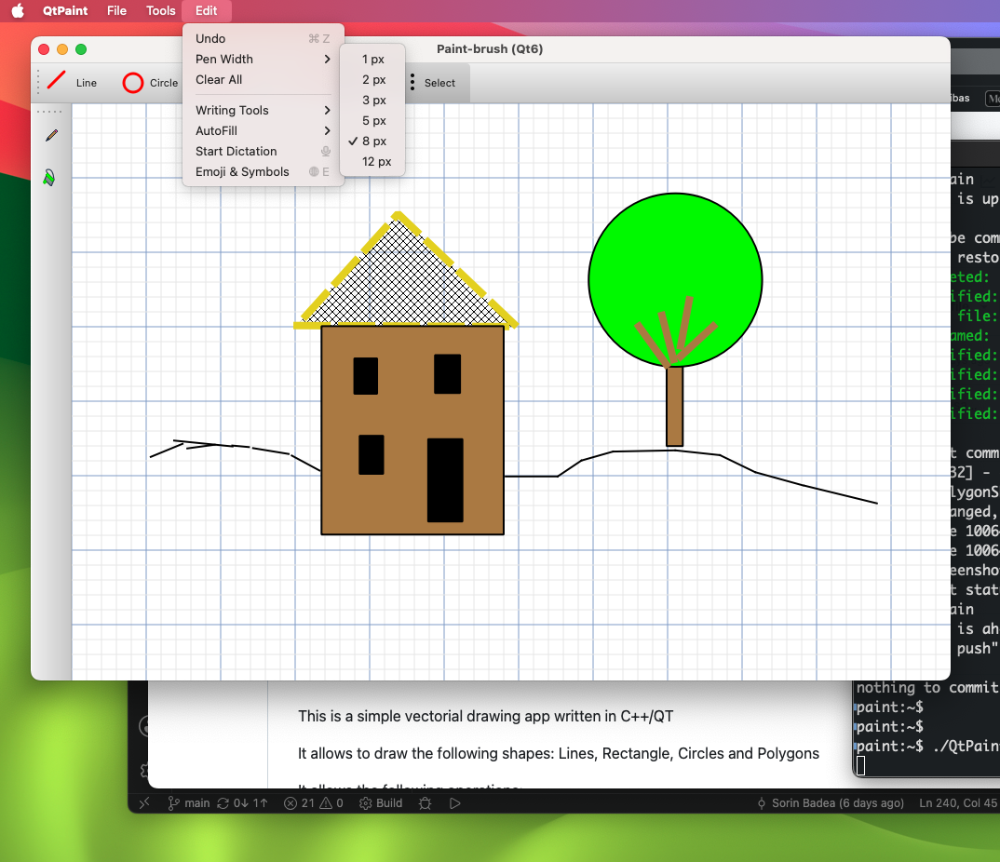

This is a simple vectorial drawing app written in C++/QT

It allows to draw the following shapes:
Lines, Rectangle, Circles and Polygons

It allows the following operations:
- draw a Line, Circle, Rectangle and Polygon lines.
- select a shape by pressing the left mouse button, than drag;
  or zooming in/out using the wheel;
- remove a selected shape;
- change the pen width, color and brush color;
- save current work that load it later;

Remark:
-some parts of the code were written using Google Gemini AI

