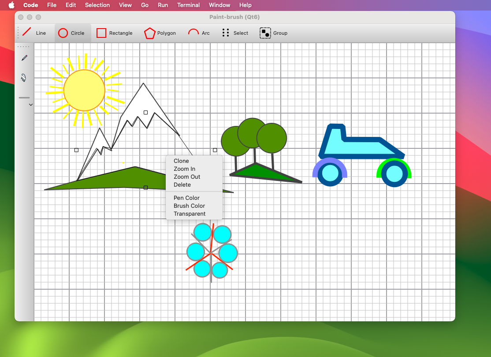

This is a simple vectorial drawing app written in C++/QT

It allows to draw the following shapes:
Lines, Rectangle, Circles, Arcs and Polygons

It allows the following operations:
- select a shape by pressing the left mouse button, than drag
  or zoom in/out using the mouse wheel;
- select a shape than resize it vertically or horizontally
  by pulling one of the 4 hooks (works for Circle/Ellipse, Rectangle and Polygon)
- the same action for the Line shape it allows to rotate the line
- remove a selected shape;
- clone a selectes shape (Copy/Paste)
- change the background or foreground color for a shape
- set the background of a shape to transparent
- group a set of shapes, than drag and change position
- change the pen width, color and brush color
- save current work that load it later

Remark:
-some parts of the code were written using Google Gemini AI

